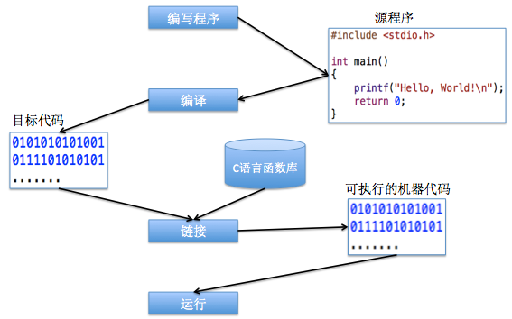

# Hello World C

> C 语言是一门面向过程的编程语言。

## 编写代码

```c
#include <stdio.h>

int main(){
    printf("Hello world \n");
    return 0;
}
```

## 编译

编译器：有 gcc、clang
执行编译命令
> -c <文件名>
> 编译：将代码文件 hello.c 转换机器能识别的二进制文件。

```shell
cc -c hello.c
```

## 链接

执行链接命令
> -o <文件名>
> 链接：将 hello.o 文件和 C 语言函数库组合生成可执行文件。

```shell
cc hello.c -o hello
```

运行 C 语言程序
>直接在终端执行👇命令

```shell
./hello
```

## 总结



`gcc/g++` (旧版 `C/C++` 编译器)
`clang/clang++` `llvm` (新版 `C/C++` 编译器)

## 参考文章

* [C/C++: clang 代替 gcc](https://fzheng.me/2016/03/15/clang-gcc/)
